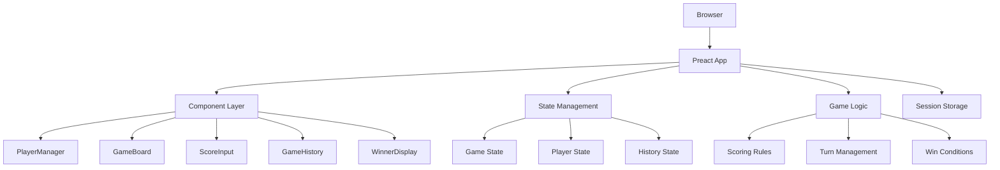
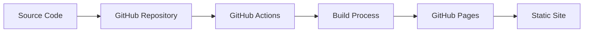
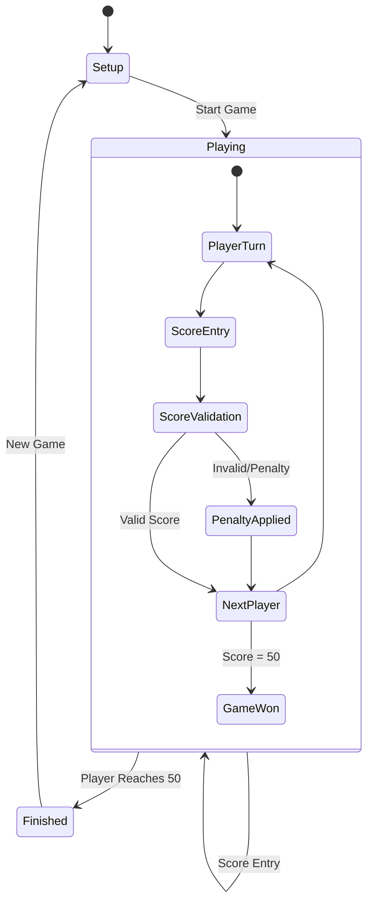

<!-- @format -->

# Design Document

## Overview

The Mölkky Score Counter is a single-page web application built with Preact that provides an intuitive interface for managing Mölkky games. The application will be hosted on GitHub Pages as a static site, requiring no backend services. All data will be stored in browser session storage to maintain game history during the current session.

The application follows a component-based architecture with clear separation of concerns between game logic, state management, and UI components. The design emphasizes simplicity, responsiveness, and ease of use across different device sizes.

## Architecture

### High-Level Architecture



### Technology Stack

- **Frontend Framework**: Preact (lightweight React alternative, ~3KB)
- **CSS Framework**: Tailwind CSS (utility-first, tree-shakeable)
- **Build Tool**: Vite (fast development and optimized builds)
- **Hosting**: GitHub Pages (static site hosting)
- **State Management**: Preact hooks (useState, useEffect, useContext)
- **Storage**: Browser sessionStorage API

### Deployment Architecture



## Components and Interfaces

### Core Components

#### 1. App Component

- **Purpose**: Root component managing global state and routing
- **Props**: None
- **State**:
  - `gameState`: Current game status (setup, playing, finished)
  - `players`: Array of player objects
  - `currentPlayerIndex`: Index of active player
  - `gameHistory`: Array of completed games

#### 2. PlayerManager Component

- **Purpose**: Handle player addition, modification, and removal
- **Props**:
  - `players`: Array of player objects
  - `onPlayersChange`: Callback for player updates
  - `gameActive`: Boolean indicating if game is in progress
- **State**:
  - `newPlayerName`: Input field value
  - `editingPlayer`: Currently editing player ID

#### 3. GameBoard Component

- **Purpose**: Display current game state and scores
- **Props**:
  - `players`: Array of player objects with scores
  - `currentPlayerIndex`: Active player index
  - `gameState`: Current game status
- **State**: None (stateless component)

#### 4. ScoreInput Component

- **Purpose**: Handle score entry and penalties
- **Props**:
  - `currentPlayer`: Active player object
  - `onScoreSubmit`: Callback for score updates
  - `onPenalty`: Callback for penalty application
- **State**:
  - `scoreValue`: Current input value
  - `inputMethod`: Single pin vs multiple pins

#### 5. WinnerDisplay Component

- **Purpose**: Show game completion and winner announcement
- **Props**:
  - `winner`: Winning player object
  - `finalScores`: Array of final player scores
  - `onNewGame`: Callback to start new game
- **State**: None (stateless component)

#### 6. GameHistory Component

- **Purpose**: Display session game history
- **Props**:
  - `gameHistory`: Array of completed games
  - `isVisible`: Boolean for modal visibility
  - `onClose`: Callback to close history view
- **State**: None (stateless component)

### Data Models

#### Player Model

```typescript
interface Player {
  id: string;
  name: string;
  score: number;
  penalties: number;
  isActive: boolean;
}
```

#### Game Model

```typescript
interface Game {
  id: string;
  players: Player[];
  winner: Player;
  startTime: Date;
  endTime: Date;
  totalRounds: number;
  penalties: PenaltyRecord[];
}
```

#### PenaltyRecord Model

```typescript
interface PenaltyRecord {
  playerId: string;
  playerName: string;
  timestamp: Date;
  reason: string;
}
```

### State Management

#### Game State Flow



#### Context Providers

- **GameContext**: Manages overall game state and player data
- **HistoryContext**: Handles game history and session storage

## Data Models

### Core Data Structures

#### Application State

```typescript
interface AppState {
  gameState: "setup" | "playing" | "finished";
  players: Player[];
  currentPlayerIndex: number;
  gameHistory: Game[];
  currentGame: Game | null;
}
```

#### Scoring System

- **Single Pin**: Score equals the number on the knocked pin (1-12)
- **Multiple Pins**: Score equals the count of knocked pins
- **Exact 50**: Player wins immediately
- **Over 50**: Player score resets to 25
- **Penalty**: Player score resets to 25

### Storage Schema

#### Session Storage Keys

- `molkky_current_game`: Current game state
- `molkky_game_history`: Array of completed games
- `molkky_app_state`: Overall application state

## Error Handling

### Input Validation

- **Player Names**: Non-empty, unique names required
- **Score Values**: Must be integers between 0-12 for single pins, 2-12 for multiple pins
- **Game State**: Prevent invalid state transitions

### Error Types and Handling

```typescript
enum ErrorType {
  DUPLICATE_PLAYER = "duplicate_player",
  INVALID_SCORE = "invalid_score",
  STORAGE_ERROR = "storage_error",
  GAME_STATE_ERROR = "game_state_error",
}

interface ErrorHandler {
  showError(type: ErrorType, message: string): void;
  clearError(): void;
}
```

### Error Recovery

- **Storage Failures**: Graceful degradation to in-memory state
- **Invalid State**: Reset to last known good state
- **Input Errors**: Clear invalid inputs and show user feedback

## Testing Strategy

### Unit Testing

- **Component Testing**: Test each component in isolation
- **Game Logic Testing**: Verify scoring rules and state transitions
- **Utility Functions**: Test helper functions and calculations

### Integration Testing

- **User Flows**: Test complete game scenarios
- **State Management**: Verify state updates across components
- **Storage Integration**: Test session storage operations

### Test Structure

```
tests/
├── components/
│   ├── PlayerManager.test.js
│   ├── GameBoard.test.js
│   ├── ScoreInput.test.js
│   └── WinnerDisplay.test.js
├── logic/
│   ├── gameLogic.test.js
│   ├── scoringRules.test.js
│   └── stateManagement.test.js
└── integration/
    ├── gameFlow.test.js
    └── storage.test.js
```

### Testing Tools

- **Test Runner**: Vitest (fast, Vite-native)
- **Component Testing**: @testing-library/preact
- **Assertions**: Built-in Vitest assertions
- **Mocking**: Vitest mocking utilities

### Responsive Design

#### Breakpoints

- **Mobile**: < 768px (single column, large touch targets)
- **Tablet**: 768px - 1024px (two column layout)
- **Desktop**: > 1024px (multi-column, compact layout)

#### Mobile-First Approach

- Touch-friendly button sizes (minimum 44px)
- Simplified navigation for small screens
- Optimized input methods for mobile devices
- Swipe gestures for navigation between views

#### CSS Architecture

- **Utility Classes**: Tailwind CSS for rapid development
- **Component Styles**: Scoped CSS modules for complex components
- **Theme System**: CSS custom properties for consistent styling
- **Dark Mode**: Optional dark theme support

### Performance Considerations

#### Bundle Optimization

- **Tree Shaking**: Remove unused code
- **Code Splitting**: Lazy load non-critical components
- **Asset Optimization**: Compress images and fonts
- **Caching Strategy**: Leverage browser caching for static assets

#### Runtime Performance

- **Virtual DOM**: Efficient updates with Preact
- **Memoization**: Prevent unnecessary re-renders
- **Debounced Inputs**: Optimize user input handling
- **Minimal State Updates**: Batch state changes when possible
