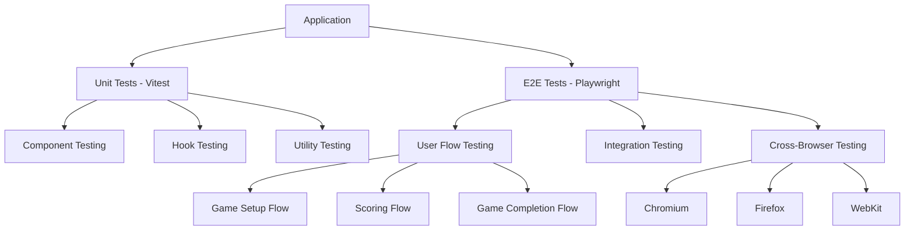

<!-- @format -->

# Design Document: Playwright Testing Implementation

## Overview

This design outlines the implementation of Playwright for end-to-end testing in the Mölkky Score Counter application. The solution will integrate Playwright alongside the existing Vitest unit testing framework, providing comprehensive browser automation testing capabilities. The implementation will focus on testing critical user flows, UI interactions, and game functionality across multiple browsers.

The current project uses Preact with TypeScript, Vite as the build tool, and Vitest for unit testing. Playwright will complement this stack by providing end-to-end testing capabilities that validate the complete user experience.

## Architecture

### Testing Architecture Overview



### Project Structure Integration

The Playwright implementation will integrate into the existing project structure:

```
project-root/
├── tests/                    # Existing test directory
│   ├── e2e/                 # New: Playwright E2E tests
│   │   ├── fixtures/        # Test fixtures and utilities
│   │   ├── pages/           # Page Object Model classes
│   │   ├── specs/           # Test specifications
│   │   └── utils/           # E2E test utilities
│   ├── components/          # Existing unit tests
│   ├── hooks/               # Existing hook tests
│   └── setup.ts             # Existing test setup
├── playwright.config.ts     # New: Playwright configuration
└── package.json             # Updated with Playwright dependencies
```

## Components and Interfaces

### 1. Playwright Configuration

**File**: `playwright.config.ts`

- Browser configuration (Chromium, Firefox, WebKit)
- Test execution settings (headless/headed mode)
- Base URL configuration for local development and CI
- Screenshot and video recording settings
- Timeout and retry configurations

### 2. Page Object Model (POM) Classes

**Base Page Class**: `tests/e2e/pages/BasePage.ts`

- Common page interactions and utilities
- Navigation helpers
- Wait strategies and element interaction methods

**Game Setup Page**: `tests/e2e/pages/GameSetupPage.ts`

- Player management interactions
- Game mode selection
- Team setup for team mode
- Start game functionality

**Game Play Page**: `tests/e2e/pages/GamePlayPage.ts`

- Score input and submission
- Penalty application
- Turn management
- Game state validation

**Game Results Page**: `tests/e2e/pages/GameResultsPage.ts`

- Winner display validation
- New game initiation
- Game history access

### 3. Test Fixtures and Utilities

**Test Fixtures**: `tests/e2e/fixtures/index.ts`

- Custom Playwright fixtures for game setup
- Player data fixtures
- Game state fixtures

**Test Utilities**: `tests/e2e/utils/testHelpers.ts`

- Common test helper functions
- Data generation utilities
- Assertion helpers specific to the game logic

### 4. Test Specifications

**Game Setup Tests**: `tests/e2e/specs/gameSetup.spec.ts`

- Player addition and removal
- Game mode selection
- Team management (for team mode)
- Validation of start game conditions

**Scoring Tests**: `tests/e2e/specs/scoring.spec.ts`

- Score input validation
- Score calculation verification
- Turn advancement
- Penalty application

**Game Flow Tests**: `tests/e2e/specs/gameFlow.spec.ts`

- Complete game scenarios
- Winner determination
- Game state transitions
- Edge cases and error handling

**Cross-Browser Tests**: `tests/e2e/specs/crossBrowser.spec.ts`

- Browser-specific functionality validation
- Responsive design testing
- Performance validation across browsers

## Data Models

### Test Data Structures

```typescript
interface TestPlayer {
  name: string;
  expectedScore?: number;
  shouldWin?: boolean;
}

interface TestGameScenario {
  players: TestPlayer[];
  gameMode: "individual" | "team";
  teams?: TestTeam[];
  expectedWinner?: string;
  scoringSequence: ScoringAction[];
}

interface ScoringAction {
  playerName: string;
  score: number;
  scoringType: "single" | "multiple";
  expectedResult?: "continue" | "penalty" | "win";
}

interface TestTeam {
  name: string;
  players: string[];
}
```

### Page Object Interfaces

```typescript
interface GameSetupPageActions {
  addPlayer(name: string): Promise<void>;
  removePlayer(name: string): Promise<void>;
  selectGameMode(mode: "individual" | "team"): Promise<void>;
  createTeam(name: string, players: string[]): Promise<void>;
  startGame(): Promise<void>;
  canStartGame(): Promise<boolean>;
}

interface GamePlayPageActions {
  submitScore(score: number, type: "single" | "multiple"): Promise<void>;
  applyPenalty(reason?: string): Promise<void>;
  getCurrentPlayer(): Promise<string>;
  getCurrentScore(playerName: string): Promise<number>;
  isGameFinished(): Promise<boolean>;
}
```

## Error Handling

### Test Error Strategies

1. **Timeout Handling**

   - Configure appropriate timeouts for different types of interactions
   - Implement retry logic for flaky operations
   - Use explicit waits for dynamic content

2. **Element Interaction Errors**

   - Robust element selection strategies
   - Fallback selectors for critical elements
   - Clear error messages for debugging

3. **Test Data Management**

   - Isolated test data for each test run
   - Cleanup procedures for test artifacts
   - Consistent test state initialization

4. **Browser-Specific Issues**
   - Browser-specific workarounds when necessary
   - Conditional test execution based on browser capabilities
   - Performance considerations for different browsers

### Error Recovery Mechanisms

```typescript
class PlaywrightErrorHandler {
  static async retryAction<T>(
    action: () => Promise<T>,
    maxRetries: number = 3,
    delay: number = 1000
  ): Promise<T>;

  static async waitForStableElement(
    page: Page,
    selector: string,
    timeout: number = 5000
  ): Promise<void>;

  static async handleModalDialogs(page: Page): Promise<void>;
}
```

## Testing Strategy

### Test Categories and Coverage

1. **Smoke Tests**

   - Basic application loading
   - Critical path functionality
   - Quick validation of core features

2. **Functional Tests**

   - Complete user workflows
   - Game logic validation
   - UI interaction testing

3. **Integration Tests**

   - Component interaction validation
   - State management testing
   - Data persistence verification

4. **Cross-Browser Tests**
   - Browser compatibility validation
   - Responsive design testing
   - Performance baseline validation

### Test Execution Strategy

1. **Local Development**

   - Headed mode for debugging
   - Single browser execution for speed
   - Watch mode for iterative development

2. **CI/CD Pipeline**

   - Headless mode for efficiency
   - Multi-browser parallel execution
   - Artifact collection (screenshots, videos, reports)

3. **Test Data Management**
   - Isolated test environments
   - Deterministic test data
   - Cleanup procedures

### Performance Considerations

1. **Test Execution Speed**

   - Parallel test execution
   - Efficient element selection strategies
   - Minimal wait times with smart waiting

2. **Resource Management**

   - Browser instance reuse where appropriate
   - Memory management for long test suites
   - Cleanup of test artifacts

3. **CI/CD Integration**
   - Optimized Docker containers for CI
   - Efficient caching strategies
   - Parallel execution across multiple agents

## Implementation Phases

### Phase 1: Foundation Setup

- Install and configure Playwright
- Set up basic project structure
- Create base page objects and utilities
- Implement basic smoke tests

### Phase 2: Core Functionality Testing

- Implement game setup flow tests
- Create scoring mechanism tests
- Add game completion flow tests
- Establish test data management

### Phase 3: Advanced Testing Features

- Add cross-browser testing
- Implement visual regression testing
- Create performance baseline tests
- Add accessibility testing

### Phase 4: CI/CD Integration

- Configure CI pipeline integration
- Set up test reporting and artifacts
- Implement test result notifications
- Optimize execution performance
